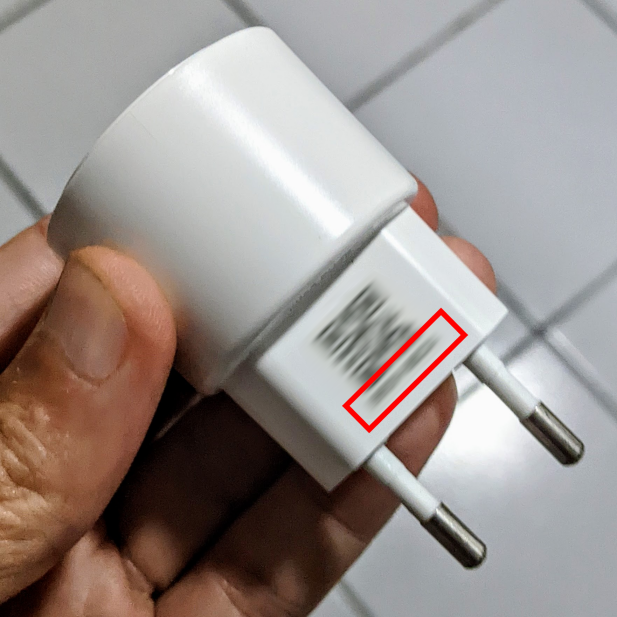
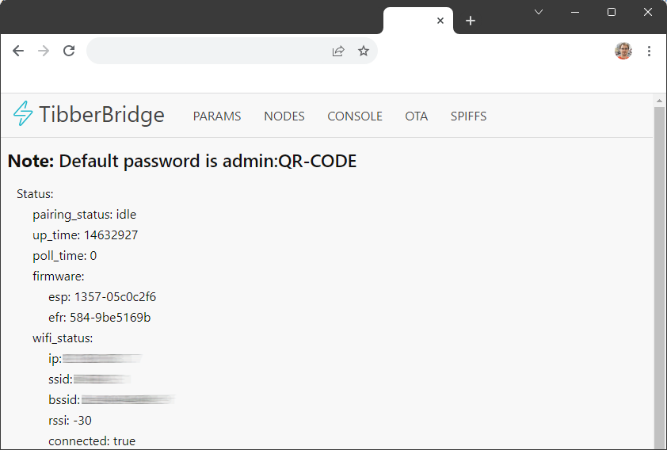

# Tibber Pulse LOCAL
If you like to access the data of your Tibber Pulse directly (instead via the detour through the cloud), then there is
a simple approach to read the data directly from the Tibber Pulse Bridge. There are alternative solutions via an
additional MQTT - but why should the data go through such a proxy, if it can be read directly.

## Know Issues

- No Logo/Icons (Tibber) for the integration (yet)
 
- Sometimes the Pulse deliver a data-package that does not contain valid data (looks like the build in webserver have a
  response buffer issue?). These invalid packages can't be read with the [python SML-Lib](https://github.com/spacemanspiff2007/SmlLib)
  and you will find then in the HA-log some `Bytes missing...` or `CRC while parse data...` messages. (when logging on
  INFO Level)
  
  If they happen the code will just try to load the data again for one time. Together with the message the actual payload
  (data that has been read from the Tibber Pulse Bridge) will also be logged. So you can verify that the data is indeed
  invalid.

## Kudos

- [@spacemanspiff2007](https://github.com/spacemanspiff2007) for providing a Python SML lib that makes reading the
  data from the Pulse almost effortless for a python noob like me
- [@ProfDrYoMan](https://github.com/ProfDrYoMan) for providing the initial idea. I failed to setup the ESP32 stuff, so
  I took the approach writing this custom integration 

## Preparation: Enabling the web frontend of the Tibber Pulse Bridge [*Required*]

To enable the web frontend permanently, one local variable needs to be set in the web frontend. But to get into the web
frontend for the first time you need to start the Tibber Pulse Bridge in AccessPoint mode. This can be done by the
following steps:

### 1. Start AP-Mode
* Unplug the Tibber bridge.
* After three seconds, plug the Tibber bridge.
* After three seconds, unplug the Tibber bridge.
* After three seconds, plug the Tibber bridge.

The LED on the Tibber bridge should now light up green and not light blue anymore.

If this is not the case, then try this alternative:
* Unplug the Tibber bridge.
* Plug the Tibber bridge
* When the bridge light in __yellow__ then unplug the bridge again
* Wait for a short while and plug in the bridge again after few seconds

NOW the LED on the Tibber bridge should now light up green and not light blue anymore.

### 2. Connect to the Pulse Bridge WiFi AccessPoint

Now use any device (laptop, tablet, phone) to connect to the `Tibber Bridge` WiFi network.  The password for the WiFi
is the nine characters printed on the Tibber bridge - it's important to include the dash. The password should have the
pattern like this example one: `AD56-54BA`.



### 3. Set `webserver_force_enable` to `true` in the web frontend

After you are connected to the WiFi that have been created by the Pulse Bridge with your laptop/phone, use a web browser
on that device to connect to <http://10.133.70.1/>. You will be prompted for a user and a password (BasicAuth).

The username is ```admin``` and the password is again the nine characters printed on the Tibber bridge.

When connected, select the param tab, there find and set the variable `webserver_force_enable` to `true`.

After setting and saving the value, remember to press *"Store params to flash"* on the bottom of the page.

__Please do not modify and other values in the params__

### 4. Bring your Pulse & Bridge back to normal operation 

Unplug the Tibber bridge, wait __ten seconds__ and plug it back again. Now it should connect back to your previously
configured WiFi and should work as before (submit the data to Tibber) - the LED should light up light blue again.

### 5. Final testing [do not continue if you did not completed this final step]

After you have successfully reset the Tibber bridge, and you have set the `webserver_force_enable` to `true` the web
frontend should now be accessible via <http://tibber_bridge/>. If this is not going to work for you, you might like to
check the IP-Address of your Tibber Pulse Bridge in your Router - The IP __is not__ the `10.133.70.1` any longer!

Personally I have configured my router in a way, that the Pulse Bridge gets allways the same IP assigned. I just can
recommend to do the same.

When you open the web frontend of the bridge, you have to provide the user `admin` and the password always.



Now (when the frontend works for you) all is prepared, so you can install and use this `Tibber Local Polling` integration

## Installation

### Hacs

[](https://github.com/hacs/integration)

- Install [Home Assistant Community Store (HACS)](https://hacs.xyz/)
- Add custom repository https://github.com/marq24/ha-tibber-pulse-local to HACS
- Add integration repository (search for "Tibber Pulse Local" in "Explore & Download Repositories")
    - Select latest version or `master`
- Restart Home Assistant to install all dependencies

### Manual

- Copy all files from `custom_components/tibber_local/` to `custom_components/tibber_local/` inside your config Home Assistant
  directory.
- Restart Home Assistant to install all dependencies

### Adding or enabling integration

#### My Home Assistant (2021.3+)

[](https://my.home-assistant.io/redirect/config_flow_start/?domain=tibber_local)

#### Manual

Add custom integration using the web interface and follow instruction on screen.

- Go to `Configuration -> Integrations` and add "Tibber Pulse Local" integration
- Specify:
  - Provide display name for the device
  - Provide the address (hostname or IP) of the Pulse Bridge
  - Provide the password of the Pulse Bridge
  - Provide the update interval (can be 2 Seconds)
  - Provide area where the Tibber Pule Bridge is located
